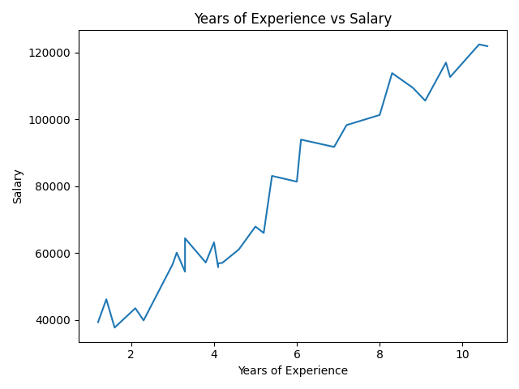

# SALARY PREDICTION MODEL
## Problem Definition : 
This project demonstrates how a simple Linear Regression model predicts salaries using a user's years of experience as input.
## Data collection :
Dataset : [Salary Dataset - kaggle.com](https://www.kaggle.com/datasets/abhishek14398/salary-dataset-simple-linear-regression)
## Data Preprocessing :
1. Handling missing values

2. Removing duplicate records

3. Dropping unnecessary column (Unnamed: 0)

4. Rearranging the data for better readability

5. Visualizing data distribution with plots
## Model Visualization :
Data Distribution using plot chart - 



from this graph we can see that, if the 'Years of Experience' is increasing the 'Salary' is also increasing.

'Years of Experience' is positively correlated with 'Salary'.
## Model Selection :
Algorithm used - Linear Regression
## Training & Validation :
1. Splitting the dataset: 80% training, 20% testing

2. Making predictions on test data

3. Evaluating the model with metrics:

4. Mean Squared Error (MSE)

5. Mean Absolute Error (MAE)

6. R² Score
## Libraries used :
1. pandas

2. numpy

3. matplotlib

4. scikit-learn :

     - train_test_split

     - LinearRegression

     - mean_absolute_error, mean_squared_error, r2_score
  5. Gradio
## How to Run :
1. clone this repository :
```bash
git clone https://github.com/sanjuktamardi/Salary-Prediction-Model.git
```
3. Navigate to the project Folder :
```bash
cd Salary-Prediction-Model
```
5. Install the dependencies :
```bash
pip install -r requirements.txt
```
7. Run the Script :
```bash
python salary_prediction.py
```
## Result / Output :
```bash
enter your years of experience : 3
based on your years of experience your salary would be :  52651.65
```
### Model Evaluation metrics :
```text
mean absolute error: 6286.453830757743
mean squared error: 49830096.855908364
r squared error: 0.9024461774180498
```
### Gradio Interface :
Deployed an interactive interface using Gradio to make predictions.

### Run the interactive app :
To try out the salary predictor interactively, run:
```bash
python salary_prediction.py
```
This will launch a Gradio app in the browser (default: http://127.0.0.1:7860)
Enter the "Years of Experience" and get the salary instantly.


